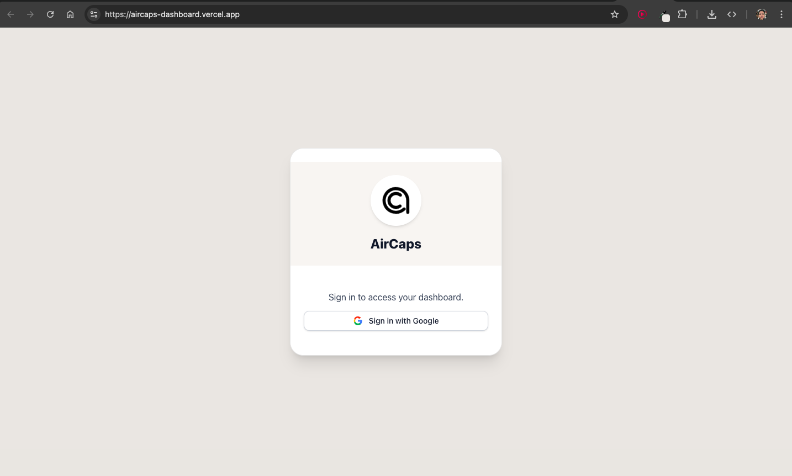
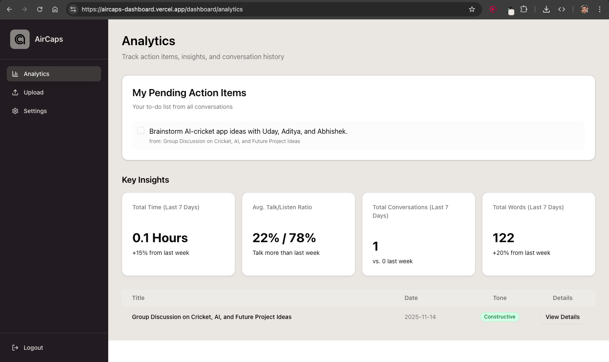
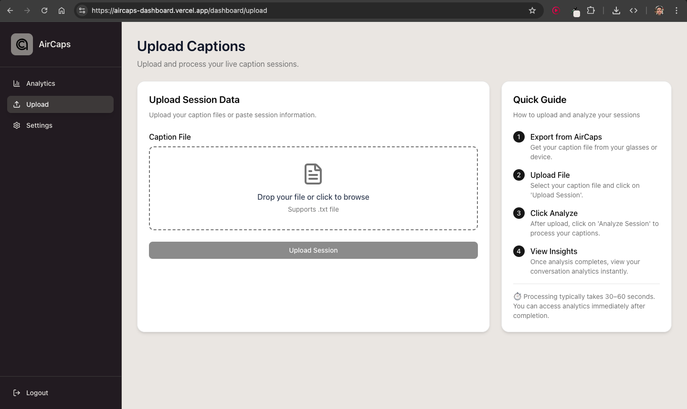
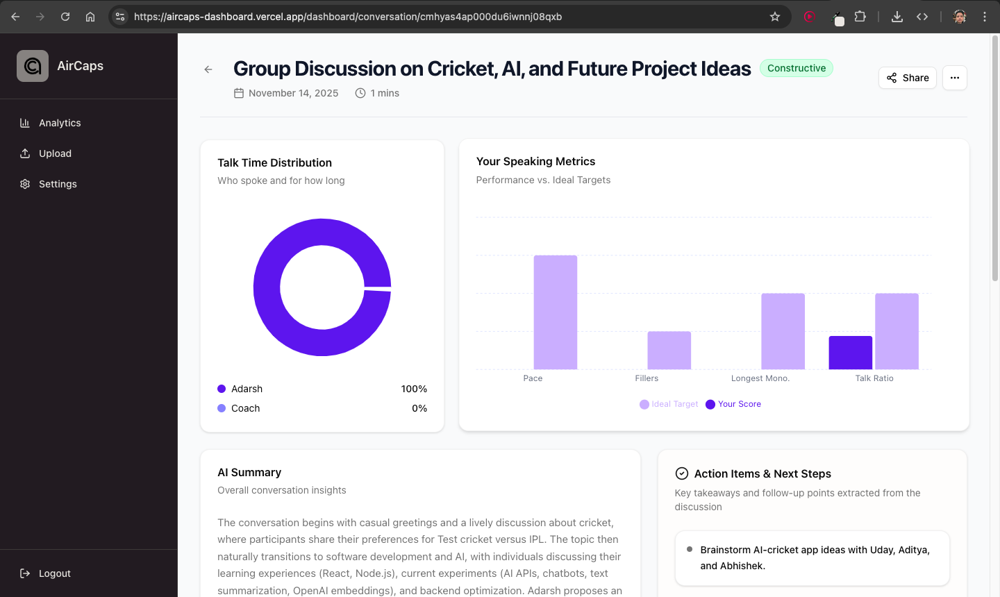
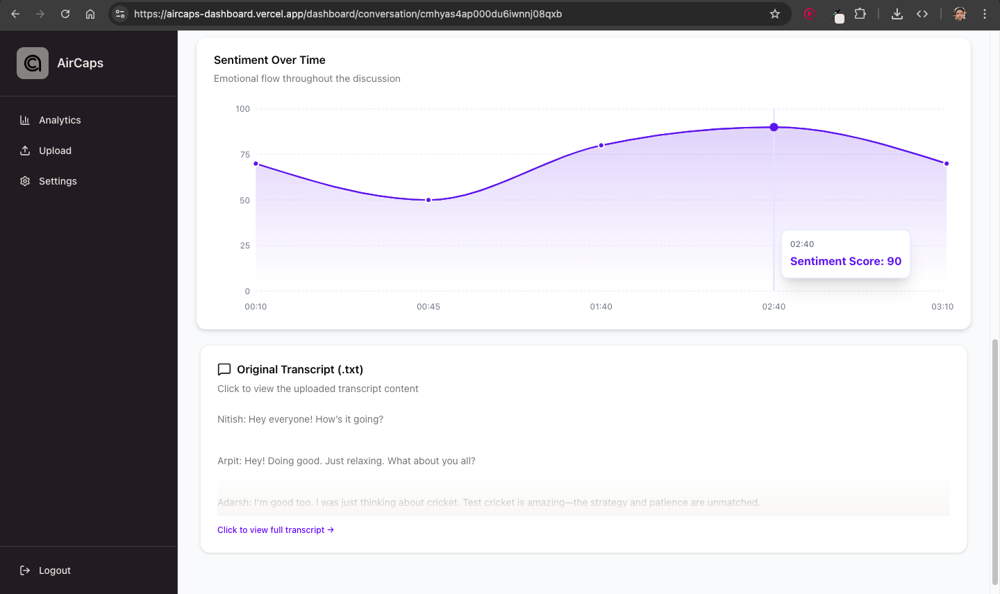
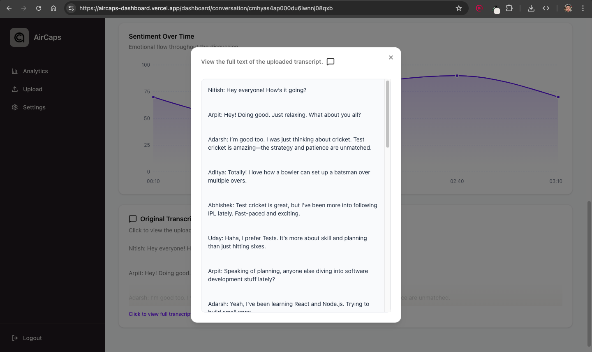

# AirCaps Dashboard MVP

AirCaps Dashboard MVP is a minimal viable product for managing, uploading, and analyzing live caption sessions captured via AirCaps Smart Glasses. The dashboard enables real-time transcription, analytics, and actionable insights for conversations.

**🌐 Live Demo:** [Access Aircaps Dashboard](https://aircaps-dashboard.vercel.app/)  
**🎬 Project Walkthrough:** [Watch on Loom]()

## ✅ Core Features

- 📤 **Upload & Process Captions** – Upload .txt caption files and process them asynchronously.
- 🧠 **🧠 AI-Powered Conversation Analysis** – Generate insights, extract action items, and identify talk/listen ratios.
- 📊 **Real-Time Speaking Metrics Dashboard** – Track total words, conversation duration, and activity trends.
- 🗂️ **Recent Conversations Table** – See your latest sessions with tone, status, and analysis results.
- 📈 **Sentiment Timeline Visualization** – Step-by-step instructions for using the dashboard efficiently.

## 🛠 Tech Stack

### **Client (Frontend)**

- ⚛️ **Next.js** – React-based framework for server-side rendering and dynamic client-side interactivity
- 🎨 **TailwindCSS, Lucide Icons, Shadcn UI, Animate.css**
- 📊 **Recharts – Analytics + visualisation components**
- 🌐 **Axios** – API requests and data fetching
- 🔒 **NextAuth** – Authentication and user management

### **Server (Backend)**

- ⚡ **Next.js** – Lightweight and flexible backend framework
- 🗄 **PostgreSQL + Prisma ORM** – Relational database with schema management
- 🔍 **Qdrant (Vector DB)** – Semantic search + embeddings
- 🧠 **LangChain + HuggingFace Inference** – LLM pipelines, text chunking
- 🧵 **BullMQ (Redis)** – Job queues for background processing
- 🛡 **Zod** – Request validation
- 🌱 **Dotenv** – Environment variable management

## 📸 Screenshots

### Backend Architecture

### Auth Page

### Analytics Page

### Upload Page

### Conversation Page

### Conversation Page II

### Conversation Page III

